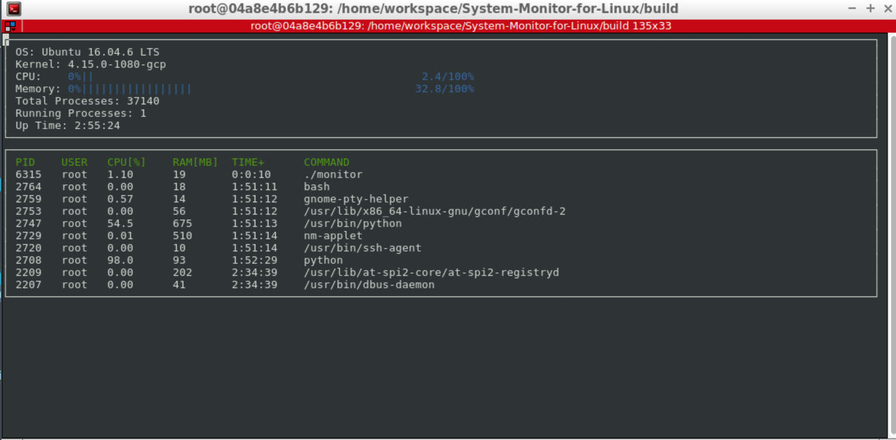

# System-Monitor-for-Linux
This is my solution for the 2nd project in Udacity's C++ Nanodegree Program. The goal of this project is to complete a system monitor running on Linux.
The initial code-base for the system monitor project in the Object Oriented Programming Course of the [Udacity C++ Nanodegree Program](https://www.udacity.com/course/c-plus-plus-nanodegree--nd213) can be found [here](https://github.com/udacity/CppND-System-Monitor-Project-Updated).

## Supported Operating Systems
This program is tested with XXX.
[Udacity](https://www.udacity.com/) provides a browser-based Linux [Workspace](https://engineering.udacity.com/creating-a-gpu-enhanced-virtual-desktop-for-udacity-497bdd91a505) for students that this program was tested with.

## Dependencies
This section lists the dependencies of the program.
### ncurses
[ncurses](https://www.gnu.org/software/ncurses/) is a library that facilitates text-based graphical output in the terminal. This project relies on ncurses for display output.

Within the Udacity Workspace, `.student_bashrc` automatically installs ncurses every time you launch the Workspace.

If you are not using the Workspace, install ncurses within your own Linux environment:
~~~
`sudo apt install libncurses5-dev libncursesw5-dev`
~~~

### Make
This project uses [Make](https://www.gnu.org/software/make/). The Makefile has four targets:
* `build` compiles the source code and generates an executable
* `format` applies [ClangFormat](https://clang.llvm.org/docs/ClangFormat.html) to style the source code
* `debug` compiles the source code and generates an executable, including debugging symbols
* `clean` deletes the `build/` directory, including all of the build artifacts

## Instructions for Deployment
To run the system monitor on your Linux-Distribution follow these instructions.
1. Clone this project repository:
~~~
git clone https://github.com/StephanStu/System-Monitor-for-Linux.git
~~~
2. Build the project:
~~~
make build
~~~
3. Run the resulting executable:
~~~
./build/monitor
~~~

